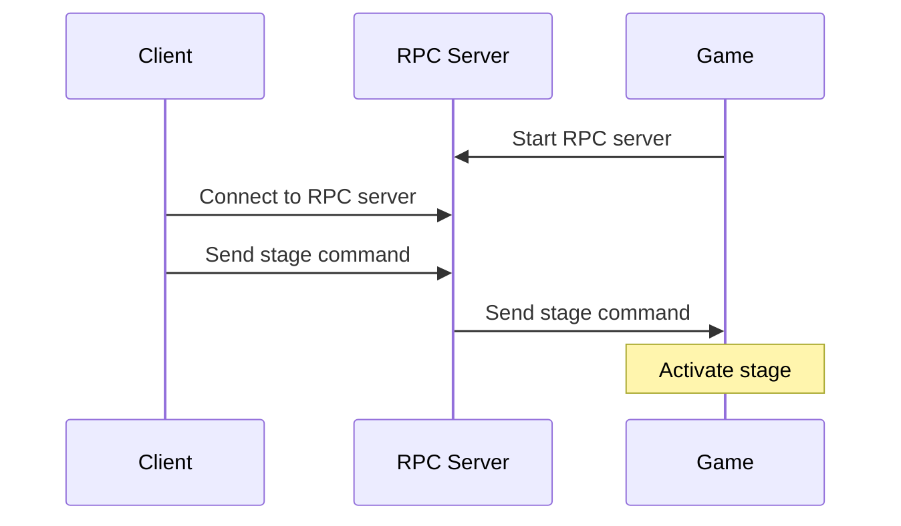

# KRPC Main Code Repo

This project will hold all code related to controlling ships in KSP via a
KRPC client running within a Docker container.

## What is KRPC?

KRPC, or Kerbal Remote Procedure Call, is a mod for [Kerbal Space Program](https://kerbalspaceprogram.com)
that allows users to control their rockets with code. There are multiple client
libraries available, allowing you the flexibility to choose to develop flight
software in one of several languages: Python, Java, C++, Lua, C#, and C-nano.

The KRPC mod itself runs using a server-client architecture, where the KSP game
instance starts up an RPC server. The client code (which can be run on a
separate machine) connects to the RPC server in-game; it provides commands and
receives data from the game.

By necessity, the KRPC server and the game must run on the same computer, since
KRPC exists as a mod for the game. The client may run on the same computer, or
(preferrably) run on an external machine and operate over the network.

Links:
- KRPC docs: https://krpc.github.io/krpc
- KSP: https://www.kerbalspaceprogram.com
