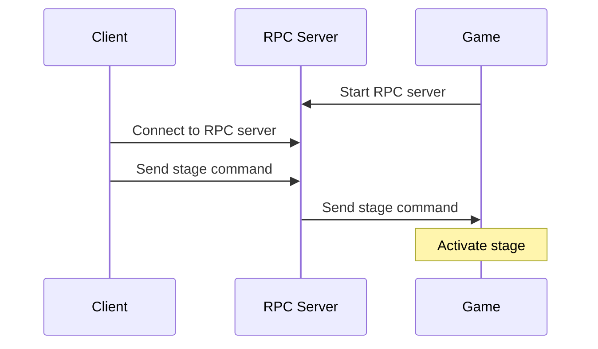

# KRPC Flight Software

This project will hold all code related to controlling ships in KSP via a
KRPC client running within a Docker container.

Requirements:
- Kerbal Space Program installed
- KRPC 0.4.9 mod installed with KSP
- Docker Compose (optional)

## Quickstart

Build and run the code via Docker Compose with:
```sh
docker-compose up --build
```

For convenience, I've provided a Makefile that allows you to perform a couple
relevant commands using `make`:
```sh
# Build the base image and compile the FSW
make

# Execute the most recent image
make run
```

To list all the `make` options I provide, use:
```sh
make help
```

Note that `Makefile` is for Docker operations, and `fsw.mak` is for actually
building the FSW. If you don't care about Docker, and have all the dependencies
installed locally, then you may simply use `fsw.make` as your main Makefile.

## What is KRPC?

KRPC, or Kerbal Remote Procedure Call, is a mod for [Kerbal Space Program](https://kerbalspaceprogram.com)
that allows users to control their rockets with code. There are multiple client
libraries available, allowing you the flexibility to choose to develop flight
software in one of several languages: Python, Java, C++, Lua, C#, and C-nano.

The KRPC mod itself runs using a server-client architecture, where the KSP game
instance starts up an RPC server. The client code (which can be run on a
separate machine) connects to the RPC server in-game; it provides commands and
receives data from the game.



By necessity, the KRPC server and the game must run on the same computer, since
KRPC exists as a mod for the game. The client may run on the same computer, or
(preferrably) run on an external machine and operate over the network.

Links:
- KRPC docs: https://krpc.github.io/krpc
- KSP: https://www.kerbalspaceprogram.com

## KRPC Source Code

The official release of KRPC is 0.4.8, found in the [official KRPC repo](https://github.com/krpc/krpc/releases).
However, this code does not compile against the current version of ASIO
(libasio-dev), because of a few recent API changes. This means there is not an
official build of KRPC that can successfully compile.

The solution has been found in a fork: [`nullprofile/krpc` version 0.4.9](https://github.com/nullprofile/krpc/releases/tag/0.4.9-1.12.1).
This forked version successfully compiles against the current version of ASIO,
and so can be used for FSW development. In the provided ZIP assets, there is
both the client code (checked into this repo in `deps/`), and the KSP mod
containing the server code.
